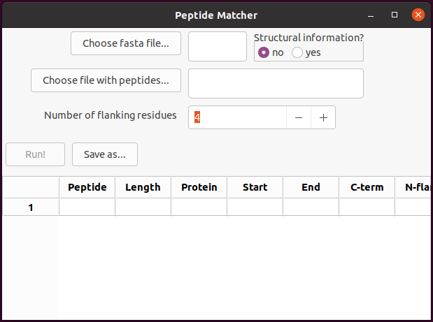

# Peptide-Matcher

Peptide-Matcher is a GUI-based software that can be used for matching peptide sequences identified in proteomics experiments using a database-match or a de novo approach against a sequence database. The main purpose is to extract sequence context for the corresponding matches, but Peptide-Matcher can also provide structural context if provided with a database that includes structural information, such as `alphafold_v*.fasta` supplied with each [release](https://github.com/alephreish/peptide-matcher/releases/).

## Installation

### Binaries

Statically built binaries are available for [download](https://github.com/alephreish/peptide-matcher/releases/) for multiple platforms.

### Source code

Otherwise the repository can be cloned (or [downloaded](https://github.com/alephreish/peptide-matcher/archive/refs/heads/master.zip)) and run in local environment:

    git clone https://github.com/alephreish/peptide-matcher.git
    python peptide-matcher/main.py

The gui is written with [wxWidgets](https://www.wxwidgets.org/). Other dependencies include [biopython](https://biopython.org/) and [pyahocorasick](https://pyahocorasick.readthedocs.io/). E.g. with pypi:

    pip install biopython wxPython pyahocorasick

Bundles are generated with [PyInstaller](https://pyinstaller.readthedocs.io/) as implemented in the `distribute.py` script.

### alphafold\_dssp pipeline

A [snakemake](https://snakemake.readthedocs.io/) workflow for generation of the fasta database containing structural information is supplied in `alphafold_dssp`. The databases used were [swisspot's human proteome](https://www.uniprot.org/proteomes/UP000005640) and pdb structures from [alphafold](https://www.alphafold.ebi.ac.uk/download) v.2 of the human proteome.

## How to use

Two files are needed: the database in fasta format with optional structural annotations for each position and a plain list of peptide sequences. Examples are provided in `alphafold_dssp/example`.

The optional structural annotations should follow a custom format. The database generated based on alphafold's models for the human proteome in swissprot is distributed with each [release](https://github.com/alephreish/peptide-matcher/releases/).

The results of the peptide matching are returned to the GUI and can be saved as xlsx (see example output in `alphafold_dssp/example/output.xlsx`). For each peptide the following output is generated:

| Field          | Description                                    | Example                       | Values                                            |
|----------------|------------------------------------------------|-------------------------------|---------------------------------------------------|
| `Peptide`      | peptide sequence                               | QVHAVSFYSK                    | string of amino acid symbols                      |
| `Length`       | peptide length                                 | 10                            | integer                                           |
| `Protein`      | matching protein id (swissprot)                | A6NL46                        | string                                            |
| `Start`        | start position (1-based)                       | 150                           | integer                                           |
| `End`          | end position (1-based)                         | 159                           | integer                                           |
| `C-term`       | distance to protein's C-terminus               | 182                           | integer                                           |
| `N-flank`      | N-flanking residues in this protein            | TDKA                          | string                                            |
| `C-flank`      | C-flanking residues in this protein            | GHGV                          | string                                            |
| `N-flank*`     | weblogo for each position of the N-flank       | {2T}{2D}{2K}{2A}              | `{}` - one position, `\|` - state separator       |
| `C-flank*`     | weblogo for each position of the C-flank       | {1G\|1D}{2H}{1G\|1E}{2V}      |                                                   |
| `N-flank SS`   | secondary structure for the N-flank            | HHHH                          | string of DSSP codes                              |
| `Peptide SS`   | same for the peptide itself                    | HH------EE                    |                                                   |
| `C-flank SS`   | same for the C-flank region                    | EEEE                          |                                                   |
| `N-flank TM`   | transmembrane region for the N-flank           | TTTT                          | string of: `T` - TM region, `S` - signal peptide  |
| `Peptide TM`   | same for the peptide itself                    | TT--------                    |                                                   |
| `C-flank TM`   | same for the C-flank region                    | ----                          |                                                   |
| `N-flank conf` | alphafold's pLDDT score for the N-flank        | 43,46,40,49                   | list of integers 0-100                            |
| `Peptide conf` | same for the peptide itself                    | 44,44,45,44,50,39,48,39,56,46 |                                                   |
| `C-flank conf` | same for the C-flank                           | 49,47,42,46                   |                                                   |
| `N-flank RSA`  | relative solvent accessibility for the N-flank | 81,79,84,71                   | list of integers 0-100                            |
| `Peptide RSA`  | same for the peptide itself                    | 90,78,75,78,54,62,73,84,73,81 |                                                   |
| `C-flank RSA`  | same for the C-flank                           | 67,78,71,80                   |                                                   |

In the provided database, the RSA values are calculated by dividing the absolute solvent accessibility (ASA) as produced by dssp (mkdssp v.3.0.0) by the theoretical maximum values for ASA from [Tien et al 2013](https://dx.doi.org/10.1371%2Fjournal.pone.0080635).

